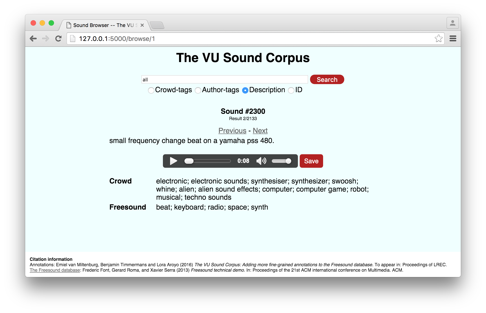

# SoundBrowser

This repository provides an interface for the VU Sound Corpus, made in Flask.
Use `python soundbrowser.py` to run it locally on `http://127.0.0.1:5000/`.

## Screenshot
Here's an image of the basic interface. The special keyword 'all' gives you all the sounds from the corpus. Other queries work as you would expect.

## More information
More information about the corpus can be found [here](https://github.com/CrowdTruth/vu-sound-corpus).
